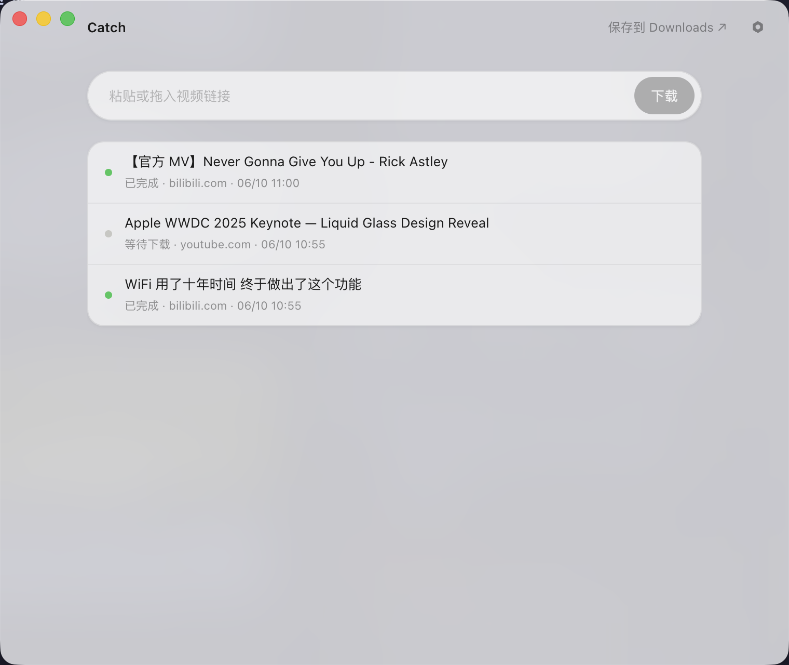

# Catch

[English](README.md) | [简体中文](README.zh-CN.md)

> Paste a link. Catch the video.

Catch is a minimal macOS video downloader with one input and one download list. It supports YouTube, Bilibili, X/Twitter, and more than 1,800 other sites through yt-dlp, BBDown, and N_m3u8DL-RE.

<p align="center">
  
</p>

## Features

- **Three ways to submit** — paste into the input, press `⌘V` anywhere in the window, or drag a link into the app.
- **Clipboard suggestion** — copy a supported video link and return to Catch for a one-click download prompt.
- **Real titles** — resolves the page title before downloading and uses it for the task and output filename.
- **Automatic engine selection** — Bilibili uses BBDown, HLS streams use N_m3u8DL-RE, and other sites use yt-dlp.
- **Actionable failures** — blocks obviously invalid links early and exposes the complete download log when an engine fails.
- **Native macOS presentation** — vibrancy, a hidden title bar, capsule controls, and light/dark appearance.
- **No telemetry** — upstream analytics and Sentry reporting have been removed.

## Installation

Download the Apple Silicon DMG from [Releases](https://github.com/realruian/catch/releases). The app is not notarized, so use right-click → **Open** the first time.

## Build from source

Requirements: Node.js 20 or newer, pnpm 10 or newer, and Go 1.22 or newer.

```bash
git clone https://github.com/realruian/catch.git
cd catch
pnpm install
pnpm deps:download
pnpm dev:electron
```

Create a DMG with:

```bash
pnpm release:electron
```

## Development checks

```bash
pnpm check
```

The project is a pnpm/Turborepo monorepo. See [CONTRIBUTING.md](CONTRIBUTING.md) for the package layout and development workflow.

## Technology

- Electron and React 19 for the desktop experience.
- Tailwind CSS 4 and Ant Design 6 for the interface.
- Go, Gin, and SQLite for download orchestration.
- [yt-dlp](https://github.com/yt-dlp/yt-dlp), [BBDown](https://github.com/nilaoda/BBDown), [N_m3u8DL-RE](https://github.com/nilaoda/N_m3u8DL-RE), and [ffmpeg](https://ffmpeg.org/) as download and media engines.

## Acknowledgements

Catch is a substantial customization of [caorushizi/mediago](https://github.com/caorushizi/mediago) under the MIT License. It replaces the interface and interaction model, narrows the product to a single download flow, adds title parsing and clipboard integration, and removes telemetry. The original copyright notice remains in [LICENSE](LICENSE).

## License and responsible use

[MIT](LICENSE). Follow the terms of service of the source website and do not download material you are not authorized to use.
